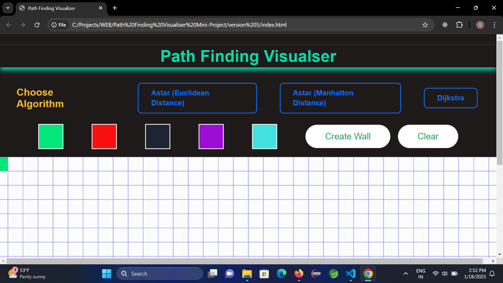
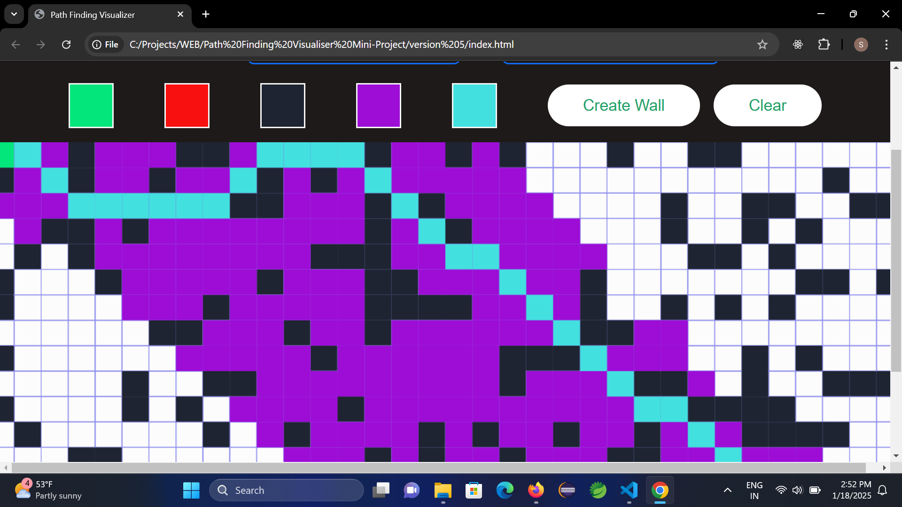
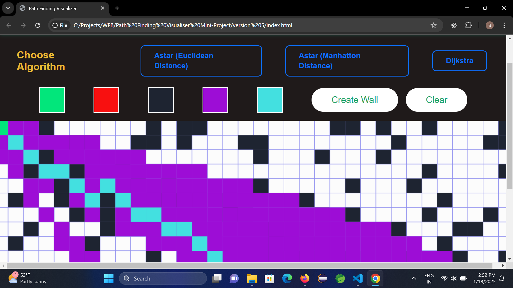
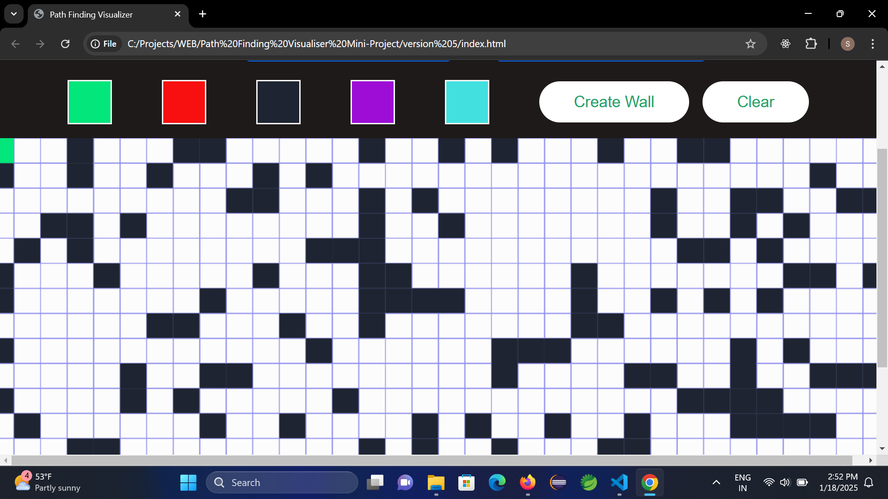

# Path Finding Visualizer

A dynamic **Path Finding Visualizer** built with **HTML**, **CSS**, and **JavaScript** that demonstrates how different pathfinding algorithms work, such as **A*(Euclidean)**, **A* (Manhatton)**, and **Dijkstra's Algorithm**. The tool allows users to visualize the shortest path between two points on a grid while navigating obstacles.

---

## 🚀 Features

- **Interactive Grid**: Users can draw walls/obstacles on the grid.
- **Multiple Algorithms**: Visualize popular algorithms like BFS, DFS, and Dijkstra's Algorithm.
- **Custom Start and End Points**: Drag and drop to set start and end nodes.
- **Real-time Visualization**: Watch as the algorithm explores the grid to find the shortest path.
- **Clear and Reset Options**: Easily reset the grid for a new visualization.

---

## 🖼️ Screenshots

### 1. Home Page

### 2. Path Visualization in Action

### 3. Obstacle Creation

---

